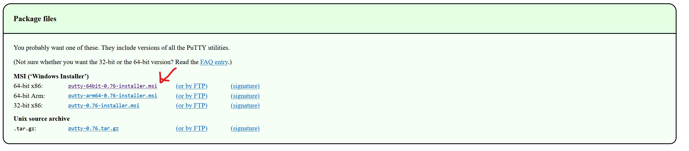
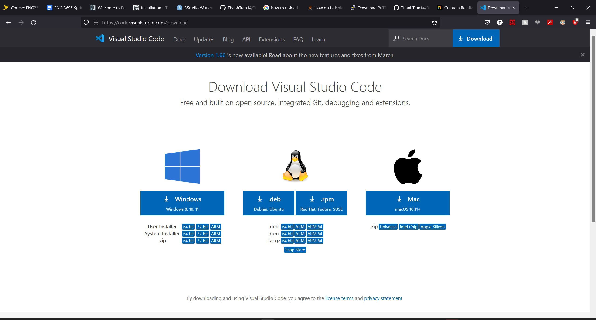

TicTacToe 

Documentation Project

By: Thanh Tran

#Introduction

I am doing my documentation project on a TicTacToe program that I have. My implementation is only Player vs Player so you need to have a friend to play this game with. Each player would get their turns and it would alternate between you and your friend. You can use this program whenever you want to play TicTacToe on the computer together.

#How to install

You can install the files that you need here: https://github.com/ThanhTran14/TicTacToe

#How to Start it up

1. There are multiple ways to play this game. You can download two different programs which is Putty or VS Code. VS Code is a nice program if you want to learn how to program because it gives you hints and gives you arrow messages. 

2. You would either download the files as a zip (green arrow) and then you would move the files into the command prompt or you can git clone into your file (red arrow).

3. You would use this line to compile the program : g++ -Wall -Werror -o tictactoe main.cc tictactoe.cc 

4. To run the program you can either use ./tictactoe or tictactoe.

5. It would ask for Player 1 information it would ask for your name then it would ask for you age.

6. It would do the same thing for Player 2

7. It would tell you how to make a valid command which would be RXCX the R meaning Row and C meaning Column.

8. You can just play til someone wins or it ends in a tie. 

#Functions

