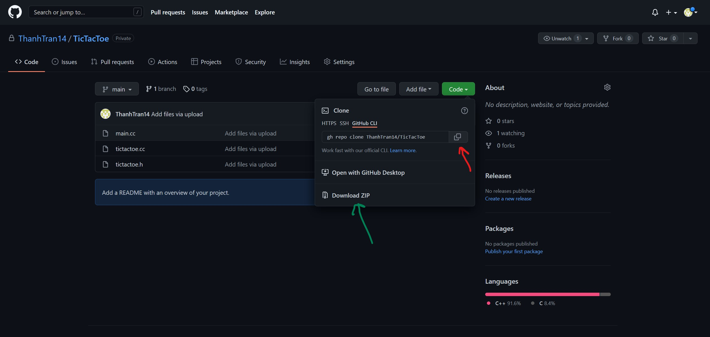

TicTacToe   Github page: https://github.com/ThanhTran14/DocumentationProjectThanhTran (Don't know if the pictures would work)

Documentation Project

By: Thanh Tran

Introduction

I am doing my documentation project on a TicTacToe program that I have. My implementation is only Player vs Player so you need to have a friend to play this game with. Each player would get their turns and it would alternate between you and your friend. You can use this program whenever you want to play TicTacToe on the computer together.

#How to install

You can install the files that you need here: https://github.com/ThanhTran14/TicTacToe

#How to Start it Up

1. There are multiple ways to play this game. You can download two different programs which is Putty or VS Code. VS Code is a nice program if you want to learn how to program because it gives you hints and gives you arrow messages. 

2. If you are ASU student you can access to the student2 machine to sign in you have userID@student2.cs.appstate.edu then your password should default to your BannerID. 

3 (Putty). On Putty you would see the header that says "Host Name (or IP Address)" you put the userID@student.cs.appstate.edu in there. Then a window should pop up and ask for your password and you just type in your BannerID (unless you changed it). When you type your password nothing would show up but it is reading it in.

3 (VS Code). You would need to download a extension called RemoteSSH and you install it. Then you would hit the green icon on the bottom left and then you should see a option that says "Connect to Host". Then it would ask for your Host ID and you would type your userID@student2.cs.appstate.edu then it would ask for your password which should be your BannerID. It would ask your multiple times to enter your password.

4. You can make a directory if you want to organize it. To do this: mkdir whatevernameyouwant

3. You would either download the files as a zip (green arrow) and then you would move the files into the command prompt or you can git clone into your file (red arrow and what I recommend you do). If you downloaded the zip you have to move it using WinSCP

3. You would use this line to compile the program : g++ -Wall -Werror -o tictactoe main.cc tictactoe.cc 

1
It the method we use to clear the board so we just make it into a empty space

getPlayerInfo()
It the method that would ask for you information and it accepts your information through the keyboard

printBoard()
It is the method to print out the board so you can see how it looks like. Then we made it so you can put the X or O there.

printTurnHeader() 
It is the method to let you know whoever turn it is.

getMove()
It is the method to accept your import and it would check if the move is valid. If someone already placed their O or X that it would say it invalid and ask you again to place your move. It would also checked if you enter the right format.

checkWin()
It is the method where it checks if you win or not.

checkTie()
It is the method where it checks if you have a tie.

runGame()
It is the method that makes all these methods work together and in order. 

